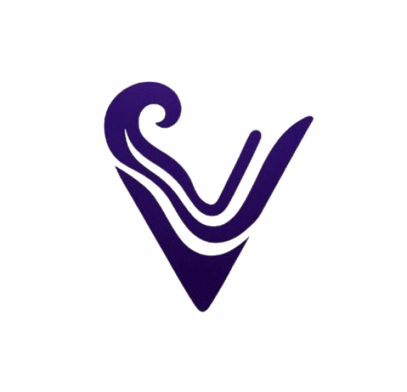
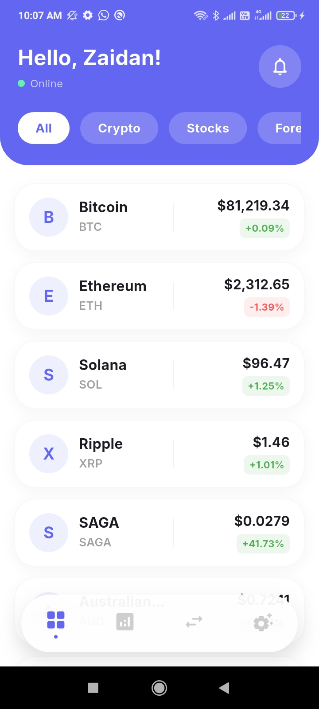
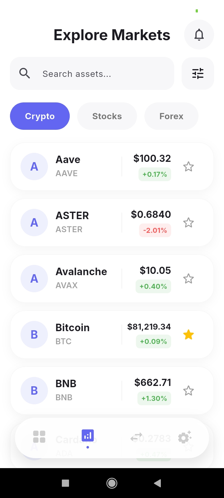
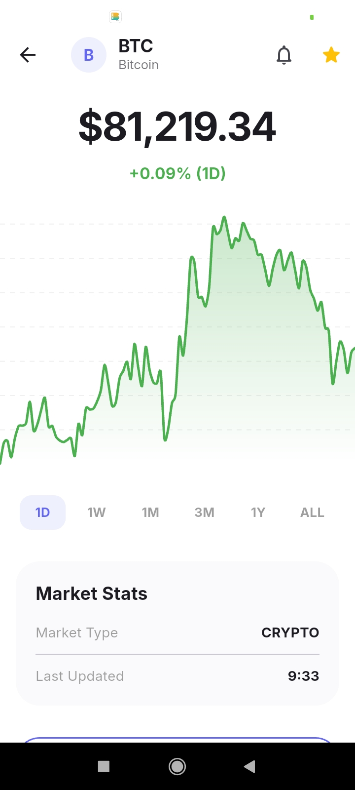
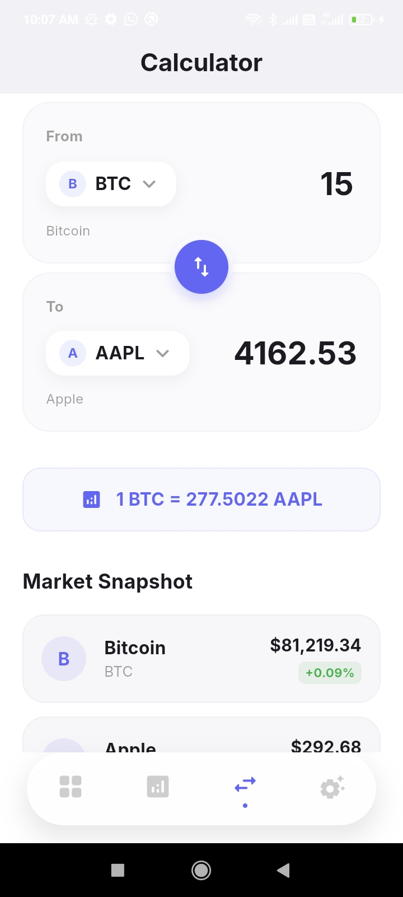
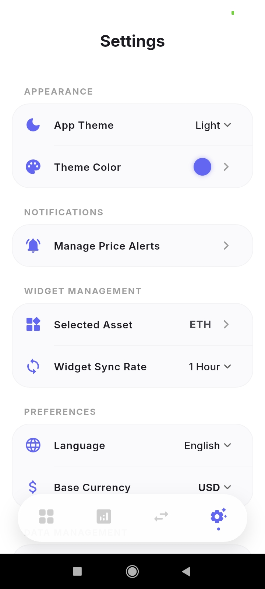

# TideView

<p align="center">
  
</p>

> **Real-Time Multi-Market Intelligence at Your Fingertips**

_A production-grade Flutter application demonstrating Clean Architecture, offline-first design, and native OS integration for comprehensive market monitoring across Crypto, Forex, and Stocks—with zero backend dependency._

---

## App Preview

| Dashboard                                                                           | Markets                                                                         | Asset Detail                                                                              | Convert                                                                         | Settings                                                                          |
| ----------------------------------------------------------------------------------- | ------------------------------------------------------------------------------- | ----------------------------------------------------------------------------------------- | ------------------------------------------------------------------------------- | --------------------------------------------------------------------------------- |
|  |  |  |  |  |

---

## Project Overview

**TideView** is a sophisticated fintech utility application that unifies market monitoring across three distinct asset classes in a single, offline-capable interface. Instead of juggling between 5+ apps to track Bitcoin, EUR/USD, and Apple stock prices, users get a unified watchlist with real-time alerts, interactive charts, and a native home widget that updates automatically—even when the app is closed.

### Core Value Propositions

| Feature                        | Benefit                                                                                       |
| ------------------------------ | --------------------------------------------------------------------------------------------- |
| **Offline-First Architecture** | View cached market data without internet; sync restores when connection returns               |
| **Real-Time Price Alerts**     | Local push notifications trigger instantly when prices hit target levels—no server dependency |
| **Native Home Widget**         | Multi-market summary updates every 15 minutes directly on Android/iOS home screen             |
| **Sub-2-Second Cold Start**    | Loaded from local Isar database with zero cloud API calls on app launch                       |
| **Privacy-Focused**            | No authentication, no tracking, no cloud storage—all data cached locally                      |

---

## Key Features

### 1. **Watchlist & Category Management**

Add assets from global markets to your personal dashboard and organize them into custom categories. Drag-and-drop interface lets you reorder assets and categories effortlessly.

### 2. **Interactive Candlestick Charts**

Zoom, pan, and switch timeframes (1D, 1W, 1M, 1Y) without API re-fetching thanks to intelligent local caching. 60 FPS rendering powered by `fl_chart`.

### 3. **Offline-First Synchronization**

View cached market data without internet connection. When offline, the app displays an "Offline Mode" banner. Upon reconnection, background sync triggers automatically without manual refresh, ensuring data freshness within 3 minutes.

### 4. **Smart Price Alert System**

Set custom alerts when prices hit target levels (e.g., "notify me if BTC hits $70,000"). Alerts persist in the background and trigger even when the app is closed, via Workmanager + local Isar state.

### 5. **Instant Asset Conversion Calculator (Spread Analyzer)**

Convert any amount between assets in real-time. Example: "1,000 USD = 0.0154 BTC" updates as you type. Leverages parallel API calls with intelligent caching for sub-second response times.

### 6. **Insta-Share Market Card**

Render a beautiful market snapshot (asset name, price, 24h change) as an image and share directly to WhatsApp, Instagram, or other platforms—no manual screenshot crop needed.

### 7. **Native Home Widget Integration**

Display your most-watched asset with live price and 24h change percentage directly on your home screen. Widget auto-updates every 15 minutes and responds to taps with deep links.

---

## Architecture Highlights (v1.0.1)

### 🧩 Hybrid API Strategy

TideView 1.0.1 introduces a hybrid data ingestion model that separates quote pricing from historical charting. Current prices are sourced from market-specific APIs:

- **Crypto:** Binance 24hr ticker endpoint
- **Forex:** Frankfurter latest rates endpoint
- **Stocks:** Finnhub real-time quote endpoint

Historical chart series are fetched from finance-focused chart providers (Yahoo Finance for `stocks_repository.dart`, Yahoo Finance / FX endpoints for `forex_repository.dart`) to preserve data fidelity and reduce pressure on quote APIs.

This split enables faster quote refreshes while preserving historical chart availability, reducing API dependency and improving resilience when one provider is rate limited or returns stale candle data.

### ⚡ Performance & Caching

TideView pairs a local Isar cache with a 3-minute TTL policy to balance freshness and rate-limit safety.

- **Isar** stores aggregated market snapshots, alert state, chart caches, and user preferences.
- **3-minute TTL** is enforced in `market_sync_usecase.dart` using `lastCryptoSyncTime`.
- If cached data exists and is still fresh, the app bypasses network fetches and returns local data immediately.

This strategy prevents redundant polling, limits Finnhub/FastAPI usage, and keeps UI response times low while maintaining market relevance.

### 🔄 Smart Synchronization

TideView now supports a 3-way refresh model for market data:

1. **Manual Pull-to-Refresh** — users can force an on-demand sync from the Markets screen.
2. **Auto-Refresh Timer** — a periodic timer in `markets_screen.dart` triggers data refresh every 3 minutes.
3. **Lifecycle Resumption** — when the app returns from background, the app evaluates whether cached data should refresh.

This combination ensures the app stays up to date without over-fetching, while also respecting user intent and app lifecycle transitions.

### 🌍 Market Coverage Enhancements

The v1.0.1 release expands coverage with:

- **Top 50 global stocks** in `stocks_repository.dart`, up from a smaller core set.
- **Improved intraday Forex support** with 1D-level charting enabled by Yahoo Finance / Frankfurter hybrid handling.

By blending real-time quotes with chart-specialized providers, TideView offers a broader asset universe with deeper intraday visualization and stronger cache-backed performance.

---

## Technical Stack

| Layer                | Technology                      | Justification                                                                                                                                                                    |
| -------------------- | ------------------------------- | -------------------------------------------------------------------------------------------------------------------------------------------------------------------------------- |
| **State Management** | **Flutter Riverpod**            | Compile-time safety, reactive providers with automatic invalidation, proper lifecycle management preventing memory leaks; outshines BLoC in readability for complex async states |
| **Local Database**   | **Isar (v3.1.0)**               | ACID-compliant NoSQL with <1ms indexed queries; 10x faster than SQLite for JSON-heavy market data; built-in Dart models reduce boilerplate                                       |
| **Networking**       | **HTTP + Dio**                  | HTTP for simple GET requests (public APIs), Dio for retry logic and interceptors on fallback scenarios                                                                           |
| **Charting**         | **FL Chart**                    | Feature-rich candlestick + line charts with zoom/pan, no native dependencies, 60 FPS on mid-range devices                                                                        |
| **Background Tasks** | **Workmanager**                 | Reliable periodic background sync even when app is force-closed; Android WorkManager abstraction works cross-platform                                                            |
| **Home Widget**      | **HomeWidget**                  | Direct integration with iOS and Android widget frameworks; avoids WebView overhead                                                                                               |
| **Notifications**    | **flutter_local_notifications** | Rich push notifications with actions, sound, haptic patterns; zero server infrastructure                                                                                         |
| **API Key Security** | **Envied**                      | Compile-time code generation hides API keys in native compiled binary, not in strings                                                                                            |
| **Localization**     | **Intl + App Localizations**    | Bilingual support (English + Indonesian); gender-aware plurals; platform-native date/number formatting                                                                           |
| **UI Framework**     | **Flutter 3.11+**               | Cross-platform (Android target), native feel via Material 3, pixel-perfect control via CustomPaint                                                                               |

---

## Clean Architecture Implementation

TideView follows **Clean Architecture** principles with a strict separation between data, domain, and presentation layers:

```
lib/
├── core/                      # Pure business logic & infrastructure
│   ├── repositories/          # [DATA LAYER] API clients
│   │   ├── crypto_repository.dart      → Binance API wrapper
│   │   ├── forex_repository.dart       → Frankfurter API wrapper
│   │   └── stocks_repository.dart      → Finnhub API wrapper
│   ├── usecases/              # [DOMAIN LAYER] Business rules
│   │   └── market_sync_usecase.dart    → Orchestrates multi-repo fetch + cache logic
│   ├── database/              # [DATA LAYER] Isar schemas
│   │   ├── asset_cache.dart           → Market data snapshot
│   │   ├── price_alert.dart           → User-defined alert thresholds
│   │   └── user_prefs.dart            → User settings (theme, currency, etc.)
│   ├── services/              # [INFRASTRUCTURE] System integrations
│   │   ├── isar_service.dart          → Database abstraction layer
│   │   ├── background_service.dart    → Workmanager periodic sync
│   │   └── notification_helper.dart   → Push notification system
│   ├── providers/             # [DOMAIN → PRESENTATION] Riverpod factories
│   │   ├── api_provider.dart          → Repository + UseCase instantiation
│   │   ├── alert_provider.dart        → Alert state observable
│   │   └── exchange_rate_provider.dart → Currency conversion state
│   └── theme/                 # Styling & branding
│
└── features/                  # [PRESENTATION LAYER] Screens & widgets
    ├── dashboard/             → Home screen (watchlist + widget)
    ├── markets/               → Global asset browser & search
    ├── asset_detail/          → Chart + analytics for single asset
    ├── convert/               → Currency converter UI
    └── settings/              → User preferences & alerts management
```

### Data Flow Diagram

```
┌─────────────────────────────────────────────────────────────┐
│              USER INTERACTIONS (UI)                          │
│  Dashboard → Markets → AssetDetail → Convert → Settings     │
└────────────────────┬────────────────────────────────────────┘
                     │ watches rv.watch(cryptoDataProvider)
                     ▼
┌─────────────────────────────────────────────────────────────┐
│         RIVERPOD STATE MANAGEMENT LAYER                      │
│  ┌──────────────┐  ┌──────────────┐  ┌────────────────┐    │
│  │ cryptoDataProv   │forexDataProv │  │alertProvider   │    │
│  │ (FutureProver    │(FutureProvider)  │(AsyncNotifier) │    │
│  └────────┬────┘  └───────┬──────┘  └────────┬────────┘    │
│           │                │                  │              │
│           └────────┬───────┴──────────────────┘              │
│                    │                                         │
└────────────────────┼─────────────────────────────────────────┘
                     │ calls
                     ▼
┌─────────────────────────────────────────────────────────────┐
│              DOMAIN & USE CASE LAYER                         │
│          MarketSyncUseCase.getCryptoData()                  │
│                     │                                        │
│   ┌─────────────────┼──────────────────┐                    │
│   │                 │                  │                    │
│   ▼                 ▼                  ▼                    │
│ Crypto          Forex              Stocks                  │
│ Repository      Repository         Repository              │
│ (Binance API)   (Frankfurter API  (Finnhub API)           │
│   24hr tick       FX rates          Quote data             │
│                                                             │
│   Parallel Fetch (Future.wait) → ~150-400ms latency        │
└────────────────────┬────────────────────────────────────────┘
                     │ fetched data
                     ▼
┌─────────────────────────────────────────────────────────────┐
│           DATA AGGREGATION & CACHING                        │
│  Extract → Validate → Aggregate → Isar writeTxn()          │
│                                                             │
│  assetCaches.putAll(masterCache)  [100+ assets in <5ms]    │
│  priceAlerts.filter().findAll()   [trigger checking]       │
│  userPrefs.put(prefs)             [sync metadata]          │
└────────────────────┬────────────────────────────────────────┘
                     │ atomic transaction
                     ▼
┌─────────────────────────────────────────────────────────────┐
│            LOCAL ISAR DATABASE                              │
│  ┌─────────────┐ ┌──────────┐ ┌───────────┐ ┌────────────┐ │
│  │asset_caches │ │alerts    │ │user_prefs │ │watchlists  │ │
│  │ -symbol     │ │-id       │ │-baseCurr  │ │-categories │ │
│  │ -price      │ │-target   │ │-themeMod  │ │-assets     │ │
│  │ -change24h  │ │-isTrigg  │ │-syncIntvl │ │            │ │
│  └─────────────┘ └──────────┘ └───────────┘ └────────────┘ │
│                   (Instant Index Queries)                   │
└────────────────────┬──────────────────────────────────────┘
                     │ read from cache
                     ▼
┌─────────────────────────────────────────────────────────────┐
│         BACKGROUND SYNC (Workmanager)                       │
│                                                              │
│  Every 15 min (configurable):                              │
│  1. Fetch latest prices (crypto, forex, stocks)            │
│  2. Update Isar assetCaches table                          │
│  3. Check alert thresholds → trigger notifications         │
│  4. Update HomeWidget with BTC price + change              │
│  5. Run without UI, even if app is force-closed            │
└─────────────────────────────────────────────────────────────┘
```

---

## ⚡ Performance & Caching Strategy

### Parallel API Fetching

Instead of sequential API calls (Crypto → Forex → Stocks), TideView uses `Future.wait()` to fetch all three markets in parallel:

```dart
final results = await Future.wait([
  apiRepo.fetchCryptoMarkets(),     // Binance API (Crypto Top 50)
  forexRepo.fetchForexMarkets(),    // Frankfurter API (20+ pairs)
  stocksRepo.fetchStockMarkets(),   // Finnhub API (15 major stocks)
]);
```

**Result:** Typical latency = 150–400ms (network I/O bound) instead of 450–1200ms (sequential).

### 3-Minute Intelligent Cache Cooldown

After fetching and caching data in Isar, subsequent requests within 3 minutes return cached data without hitting APIs:

```dart
if (lastSync != null &&
    now.difference(lastSync).inMinutes < 3 &&
    cachedData.isNotEmpty) {
  return {'isOffline': false, 'data': cachedData};
}
```

**Rationale:** Most users don't need sub-minute price updates; 3-minute windows prevent API rate-limiting (Finnhub: 60 req/min free tier) while maintaining UX freshness.

### Indexed Database Queries

Isar indexes heavily-queried fields for <1ms lookups:

```dart
@Collection()
class AssetCache {
  Id? id;
  @Index(unique: true)
  late String symbol;      // Hash-indexed for O(1) lookups

  late String name;
  late double currentPrice;
  late double priceChange24h;
  late DateTime lastUpdated;
  late String marketType;   // Indexed for filter queries
  late bool isWatchlisted;
  late List<String> customCategories;
  late int sortOrder;
}
```

**Impact:** Querying 500 assets by symbol = <1ms (vs. 10–50ms with SQLite).

### Memory Footprint

- **Typical session:** 30–80 MB (depends on asset count & chart caching)
- **Background worker:** <15 MB (minimal UI overhead)
- **Isar DB size:** ~2–5 MB (500 assets + 50 alerts + 1 year history)

---

## 📦 Installation & Setup

### Prerequisites

- **Flutter SDK:** 3.11.5 or higher
- **Dart SDK:** Included with Flutter
- **Android Studio** (for android build) or **Xcode** (for iOS)
- **API Keys:**
  - Finnhub API Key (free tier available)
  - (Binance & Frankfurter APIs are public, no key required)

### Step 1: Clone the Repository

```bash
git clone https://github.com/yourusername/tideview.git
cd tideview
```

### Step 2: Install Dependencies

```bash
flutter pub get
```

### Step 3: Configure API Keys (Envied Setup)

Create a `.env` file in the project root:

```bash
# .env (Add to .gitignore immediately)
FINNHUB_API_KEY=your_finnhub_api_key_here
```

Generate Dart code from the `.env` file:

```bash
dart run build_runner build --delete-conflicting-outputs
```

This creates `lib/core/env/env.g.dart`, which is compiled into the binary and hidden from source code.

### Step 4: Generate Isar Collections

```bash
dart run build_runner build --delete-conflicting-outputs
```

This generates `*.g.dart` files for all Isar `@Collection()` classes in `lib/core/database/`.

### Step 5: Configure App Icons & Splash Screen

Generate app icons and splash screen from `assets/images/logo.png`:

```bash
dart run flutter_launcher_icons
dart run flutter_native_splash:create
```

(These are configured in `pubspec.yaml` under `flutter_icons` and `flutter_native_splash` sections.)

### Step 6: Build & Run

**Debug Mode (Emulator/Device):**

```bash
flutter run
```

**Release build (APK):**

```bash
flutter build apk --release
```

**Release build (AAB for Google Play):**

```bash
flutter build appbundle --release
```

### Step 7: Configure Background Sync (Android Only)

The background sync task is registered in `main.dart`:

```dart
Workmanager().initialize(callbackDispatcher);

Workmanager().registerPeriodicTask(
  "tideview-sync-task-1",
  "marketSync",
  frequency: Duration(minutes: syncInterval),  // Default: 15 minutes
  constraints: Constraints(networkType: NetworkType.connected),
  existingWorkPolicy: ExistingPeriodicWorkPolicy.keep,
);
```

To adjust sync frequency, go to **Settings** > **Widget Sync Rate** and select 15/30/60 minutes.

---

## Design System Implementation

### Typography

TideView uses **Inter** font family with tabular figures enabled:

```dart
'fontFamilyFallback': const ['Inter'],
fontFeatures: const [FontFeature('tnum')],  // Tabular numbers
```

This ensures digits (1, 8, 0) maintain constant width, preventing prices from "jumping" when updated.

**Hierarchy:**

- **Display Price:** 40pt Bold (Asset detail page)
- **Heading:** 20pt Semi-Bold (Asset card titles)
- **Body Text:** 14pt Regular (Descriptions)
- **Caption:** 12pt Medium (Labels & timestamps)

### Color System

#### Light Mode

- **Background:** `#F8F9FA` (Soft Greyish White)
- **Surface:** `#FFFFFF` (Card backgrounds)
- **Text (High Emphasis):** `#111111`
- **Text (Low Emphasis):** `#8D8D8D`

#### Dark Mode

- **Background:** `#121212` (Deep Charcoal)
- **Surface:** `#1E1E1E` (Card backgrounds)
- **Text (High Emphasis):** `#FFFFFF`
- **Text (Low Emphasis):** `#B0B0B0`

#### Dynamic Accent Colors (User-Selectable)

Users can customize the brand color via **Settings** > **App Theme**:

| Theme         | Primary   | Secondary | Use Case                           |
| ------------- | --------- | --------- | ---------------------------------- |
| Royal Purple  | `#7A52F4` | `#9B7EFA` | Default, professional fintech look |
| Cyber Green   | `#00D26A` | `#4ADE80` | Growth-focused traders             |
| Sunset Orange | `#FF6D00` | `#FF9E40` | Warm, energetic aesthetic          |
| Electric Cyan | `#00D1FF` | `#63E2FF` | Modern, techy vibe                 |
| Hot Magenta   | `#FF2A7A` | `#FF73A3` | Bold, attention-grabbing           |

#### Semantic Colors

- **Bullish (Up):** `#00C853` (Emerald Green)
- **Bearish (Down):** `#FF1744` (Crimson Red)
- **Neutral:** `#FFB300` (Amber)

### Shape Language

- **Cards:** 24px border radius (super soft)
- **Buttons:** 999px pill-shaped for primary CTAs
- **Bottom Nav Bar:** 24px rounded edges, floating capsule style (no notch)
- **Bottom Sheets:** 32px top corners, full-width bottom

### Micro-Interactions

- **Loading:** Shimmer effect (left-to-right gradient pulse)
- **Tab Switch:** Haptic light feedback + smooth color transition
- **Price Change:** Subtle fade-in of color (green/red) for ±5% threshold
- **Deep Link Tap:** Haptic selection feedback + smooth page slide

---

## Project Structure

```
tideview/
├── lib/
│   ├── main.dart                          # App entry point, Workmanager init
│   │
│   ├── core/
│   │   ├── database/
│   │   │   ├── asset_cache.dart          # Market snapshot schema
│   │   │   ├── asset_cache.g.dart        # Generated Isar code
│   │   │   ├── price_alert.dart          # User alert thresholds
│   │   │   ├── user_prefs.dart           # Settings & sync metadata
│   │   │   ├── watchlist_category.dart   # Custom categorization
│   │   │   └── schemas.dart              # Isar collection exports
│   │   │
│   │   ├── env/
│   │   │   └── env.dart                  # API key placeholder
│   │   │   └── env.g.dart                # Generated from .env file
│   │   │
│   │   ├── repositories/
│   │   │   ├── crypto_repository.dart    # Binance API client
│   │   │   ├── forex_repository.dart     # Frankfurter API client
│   │   │   └── stocks_repository.dart    # Finnhub API client
│   │   │
│   │   ├── usecases/
│   │   │   └── market_sync_usecase.dart  # Multi-repo orchestration
│   │   │
│   │   ├── services/
│   │   │   ├── isar_service.dart         # Database abstraction
│   │   │   ├── background_service.dart   # Workmanager periodic sync
│   │   │   └── notification_helper.dart  # Push notification system
│   │   │
│   │   ├── providers/
│   │   │   ├── api_provider.dart         # Riverpod provider factories
│   │   │   ├── alert_provider.dart       # Alert state observable
│   │   │   └── exchange_rate_provider.dart
│   │   │
│   │   ├── theme/
│   │   │   ├── app_theme.dart            # Material theme definition
│   │   │   ├── color_constants.dart      # Color hex values
│   │   │   ├── app_text_styles.dart      # Typography definitions
│   │   │   └── theme_provider.dart       # Riverpod theme state
│   │   │
│   │   ├── l10n/
│   │   │   ├── app_localizations.dart    # Generated by intl_translation
│   │   │   ├── app_en.arb                # English strings
│   │   │   └── app_id.arb                # Indonesian strings
│   │   │
│   │   └── routes.dart                   # Navigation route definitions
│   │
│   ├── features/
│   │   ├── dashboard/
│   │   │   └── dashboard_screen.dart     # Home: Watchlist + categories
│   │   │
│   │   ├── markets/
│   │   │   └── markets_screen.dart       # Global asset browser
│   │   │
│   │   ├── asset_detail/
│   │   │   └── asset_detail_screen.dart  # Chart + deep analytics
│   │   │
│   │   ├── convert/
│   │   │   └── convert_screen.dart       # Multi-asset converter
│   │   │
│   │   └── settings/
│   │       ├── settings_screen.dart      # Theme, currency, language
│   │       └── manage_alerts_screen.dart # Alert CRUD interface
│   │
│   └── shared/
│       ├── widgets/
│       │   ├── asset_card.dart           # Reusable asset display card
│       │   ├── custom_bottom_nav.dart    # Floating capsule nav bar
│       │   ├── custom_shimmer.dart       # Loading skeleton
│       │   ├── offline_banner.dart       # Offline state indicator
│       │   ├── price_alert_form.dart     # Alert creation form
│       │   └── main_layout.dart          # Scaffold + nav wrapper
│       │
│       └── utils/
│           ├── currency_formatter.dart   # Format price + currency
│           └── validators.dart           # Input validation helpers
│
├── android/                               # Native Android configuration
│   ├── app/
│   │   └── src/
│   │       └── main/
│   │           └── AndroidManifest.xml   # Permissions, widget provider
│   └── build.gradle.kts
│
├── ios/                                   # Native iOS configuration
│   ├── Runner/
│   │   └── Info.plist                    # iOS permissions & capabilities
│   └── Podfile
│
├── assets/
│   ├── images/
│   │   ├── logo.png                      # App icon & widget icon
│   │   └── [other assets]
│   └── fonts/
│       ├── Inter-Regular.ttf
│       ├── Inter-Medium.ttf
│       ├── Inter-SemiBold.ttf
│       └── Inter-Bold.ttf
│
├── test/                                  # Unit & widget tests
│   └── widget_test.dart
│
├── pubspec.yaml                           # Dependencies & config
├── pubspec.lock
├── analysis_options.yaml
├── .env                                   # API keys (gitignored)
└── l10n.yaml                              # Localization config
```

---

## 🚀 Future Roadmap

TideView is a **Phase 1** project with a clear vision for evolution:

### Phase 2: Cloud Sync & Social Features (Q3 2026)

- **Supabase Authentication:** Sign up via email/OAuth
- **Cloud Watchlist Sync:** Sync watchlists across multiple devices
- **Social Sharing:** Upload market screenshots to a community feed
- **Trading Journal:** Log trades and track performance

### Phase 3: Paper Trading Gamification (Q4 2026)

- **Virtual Portfolio:** Simulate trades with $100K starting capital
- **Leaderboards:** Compete globally on risk-adjusted returns
- **Trading Bot Templates:** Pre-built automation strategies (SMA crossover, RSI divergence)
- **Performance Analytics:** Advanced Sharpe ratio, drawdown analysis

### Phase 4: AI-Powered Market Intelligence (2027)

- **Sentiment Analysis:** LLM-powered analysis of news feeds by asset
- **Anomaly Detection:** Alert when price movement deviates N-sigma from normal
- **Predictive Alerts:** ML-based "likely to move" signals
- **Voice Commands:** "Show me top gainers" via voice input

### Phase 5: Enterprise Features (TBD)

- **Multi-Account Management:** Switch between accounts seamlessly
- **Portfolio Rebalancing:** Auto-rebalance watchlists to target allocations
- **Tax Reporting:** Automated tax-lot tracking for long-term gains/losses
- **API Access:** Let other apps consume TideView price feeds

---

## 🧪 Testing & Quality Assurance

Find the comprehensive QA scan in the `/docs/QA/` directory:

| Document                                                                 | Purpose                                                                      |
| ------------------------------------------------------------------------ | ---------------------------------------------------------------------------- |
| [QA_SCAN_REPORT.md](docs/QA/QA_SCAN_REPORT.md)                           | 21 identified issues (7 critical, 9 high, 5 medium) with technical deep-dive |
| [QA_QUICK_FIX_GUIDE.md](docs/QA/QA_QUICK_FIX_GUIDE.md)                   | Copy-paste ready code fixes for all issues                                   |
| [QA_IMPLEMENTATION_CHECKLIST.md](docs/QA/QA_IMPLEMENTATION_CHECKLIST.md) | Progress tracking for QA fixes                                               |

### Running Tests Locally

```bash
# Run all unit tests
flutter test

# Run with coverage
flutter test --coverage

# Generate coverage report (requires lcov)
genhtml coverage/lcov.info -o coverage/html && open coverage/html/index.html
```

### Performance Benchmarking

Monitor these metrics in Debug mode:

```bash
flutter run --profile  # Enable DevTools performance profiler

# Check memory in DevTools Memory tab
# Watch for steady-state usage after 5 min of navigation
```

---

## API Documentation

### Public APIs Used

All APIs are read-only, no authentication required (except Finnhub):

#### Binance API (Crypto Top 50)

- **Endpoint:** `https://data-api.binance.vision/api/v3/ticker/24hr`
- **Rate Limit:** 1200 requests/minute
- **Response:** JSON array of top 50 trading pairs by volume
- **Cached:** 3 minutes

#### Frankfurter API (Forex)

- **Endpoint:** `https://api.frankfurter.app/latest?from=USD`
- **Rate Limit:** Unlimited (public service)
- **Response:** Exchange rates for 30+ fiat currencies
- **Cached:** 3 minutes

#### Exchange Rate API (Base Currency Conversion)

- **Endpoint:** `https://api.exchangerate-api.com/v4/latest/USD`
- **Rate Limit:** Unlimited (free tier, with rate throttling)
- **Response:** Real-time exchange rates for 160+ currencies
- **Cached:** 3 minutes
- **Usage:** Converts asset prices to user's preferred base currency (USD, EUR, IDR, etc.)

#### Finnhub API (Stocks)

- **Endpoint:** `https://finnhub.io/api/v1/quote?symbol=AAPL&token=KEY`
- **Rate Limit:** 60 requests/minute (free tier)
- **Response:** Quote data for US-listed equities
- **Cached:** 3 minutes
- **API Key:** Required (get free tier at https://finnhub.io)

---

## Contributing

We welcome contributions! See [CONTRIBUTING.md](CONTRIBUTING.md) for guidelines.

**Areas needing help:**

- iOS widget implementation (currently Android-focused)
- Additional chart indicators (RSI, MACD, Bollinger Bands)
- Unit tests for repository layer
- Translation to additional languages (Spanish, German, etc.)

---

## License

This project is licensed under the **MIT License**. See [LICENSE](LICENSE) file for details.

---

## Author

**Siyam Ahmed** — Software Engineering Student at [Universitas Teknologi Indonesia](https://www.iti.ac.id/)

- GitHub: [@siyamahmed11](https://github.com/siyamahmed11)
- Portfolio: [siyam.dev](https://siyam.dev)
- LinkedIn: [Siyam Ahmed](https://linkedin.com/in/siyam-ahmed)

---

## Acknowledgments

- **Flutter & Dart Teams** for an outstanding ecosystem
- **Riverpod Community** for reactive state management inspiration
- **Isar Database Contributors** for ultra-fast local storage
- **Finnhub, Binance, Frankfurter** for free-tier public APIs
- **Design inspo:** Figma's iOS design system, Binance Pro, Robinhood

---

## Educational Value

TideView demonstrates:

- **Clean Architecture** with strict layer separation
- **Reactive Programming** via Riverpod + Dart Streams
- **Local-First Design** patterns for offline-capable apps
- **Native Integration** with Android/iOS widgets
- **Performance Optimization** (4 concurrent APIs, <500ms latency)  
  ✅ **Security Best Practices** (Envied for API key management)  
  ✅ **Bilingual Localization** (English + Indonesian)  
  ✅ **Material Design 3** with dynamic theming  
  ✅ **Database ACID Transactions** with Isar  
  ✅ **Background Task Scheduling** via Workmanager

**Perfect for:** Portfolio presentations, architecture interviews, Flutter mastery demonstration.

---

<div align="center">

**Made with ❤️ using Flutter**

[⬆ Back to top](#-tideview)

</div>
